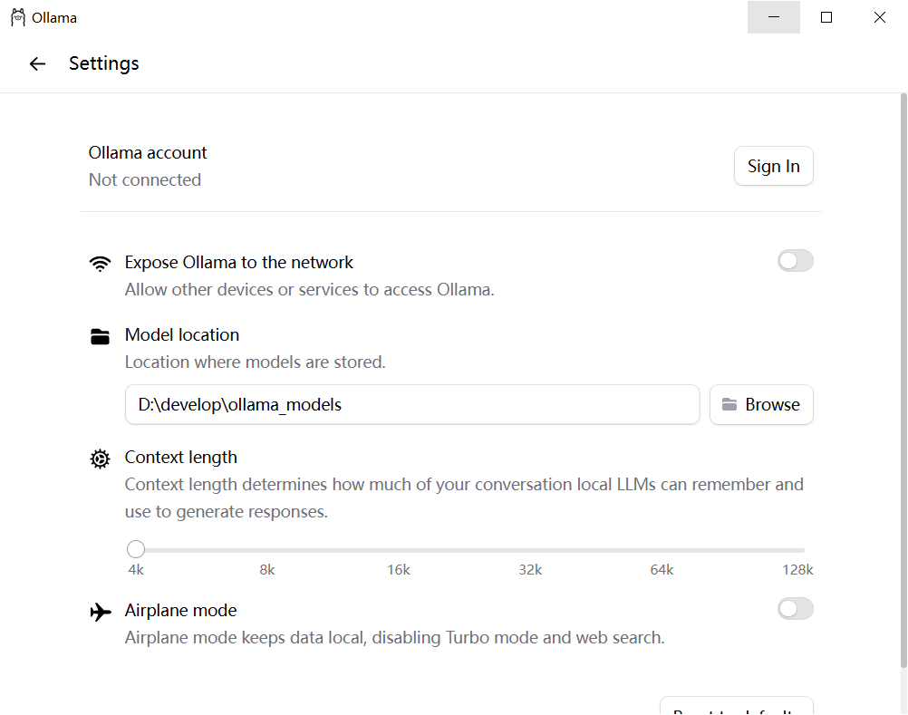
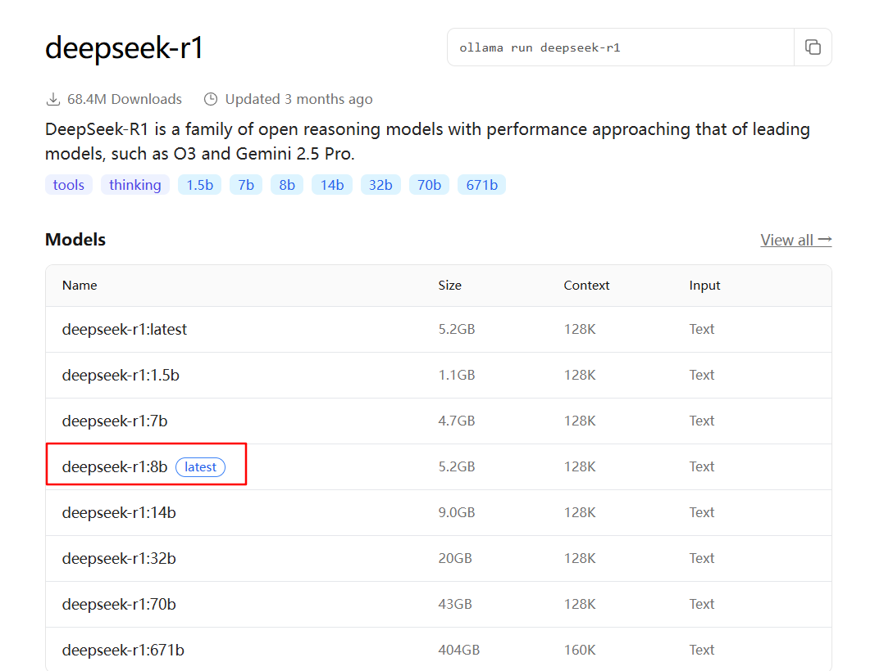
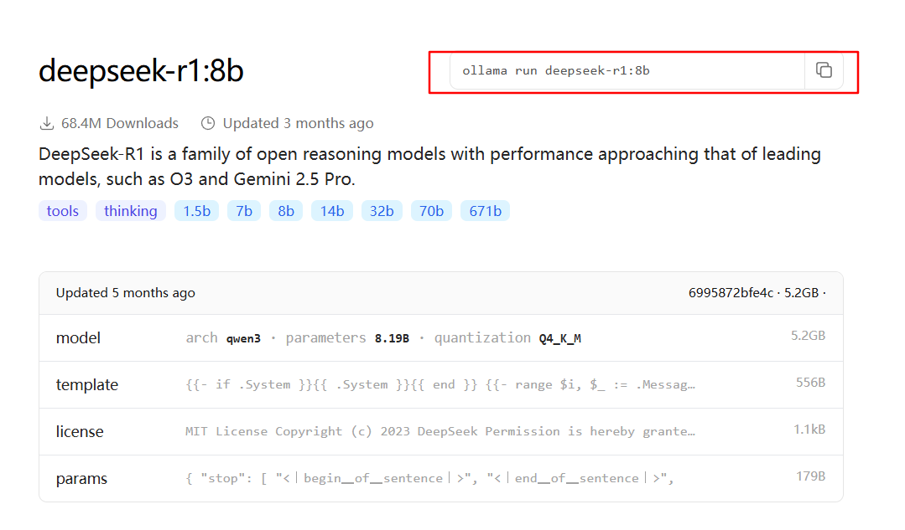
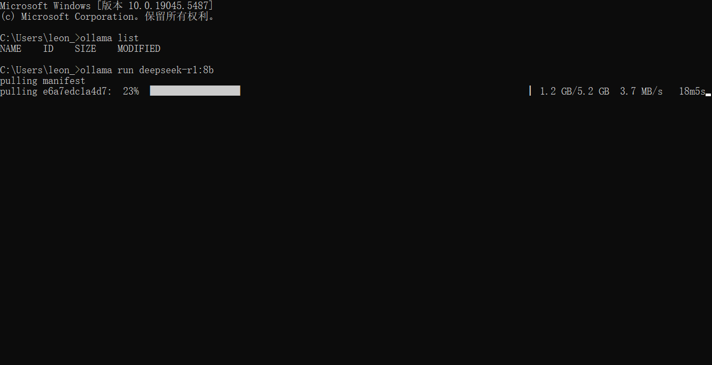

# 下载
https://ollama.com/

# 安装
双击安装, 默认安装在C盘

# 初始化配置
## 模型下载存储路径配置（选择非C盘）

## 模型下载
https://ollama.com/search
选择需要的模型

复制右上角命令并在cmd窗口执行

# 运行
当cmd窗口关闭之后, 想要再次运行模型, 只需要复制上面的命令在cmd窗口再次执行即可
如：ollama run deepseek-r1:8b